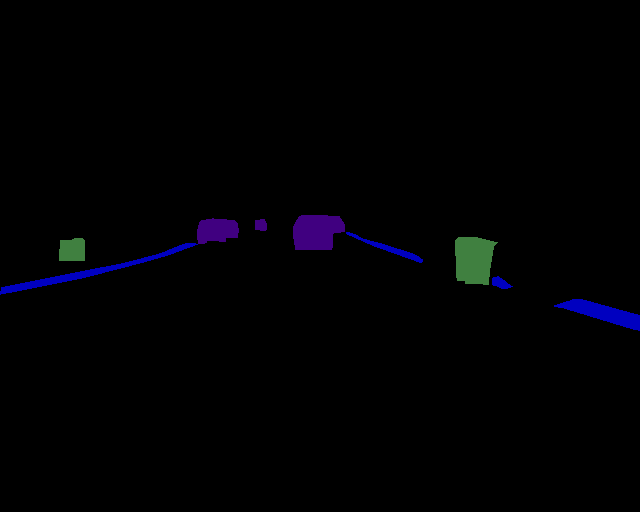
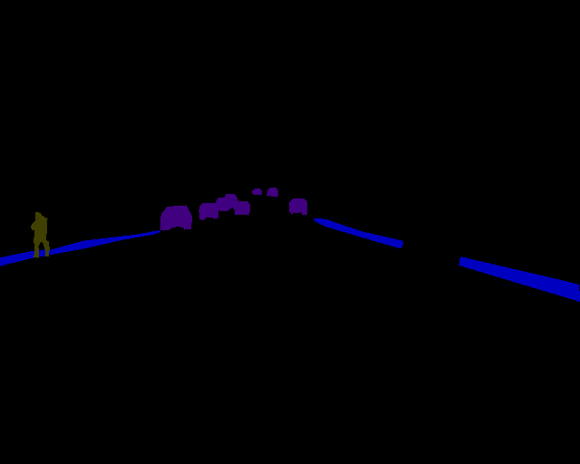
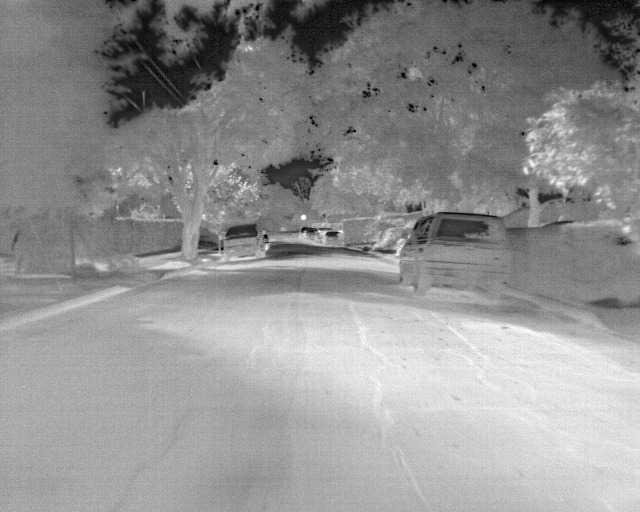
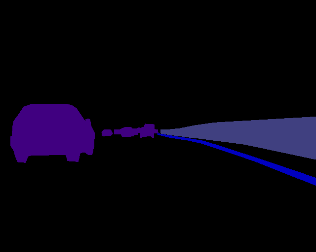
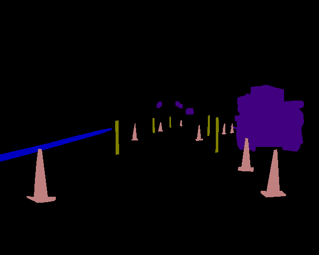
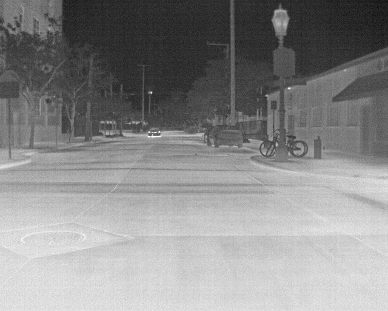
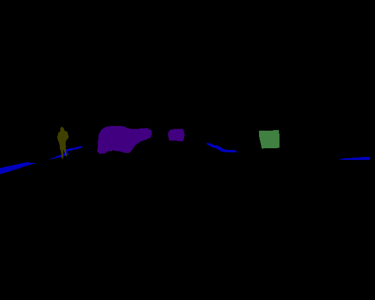
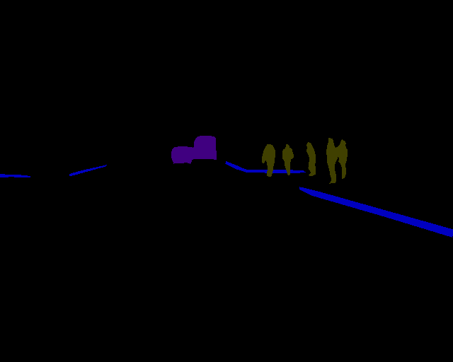
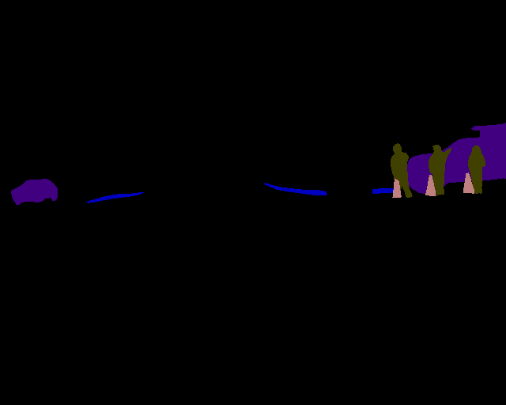
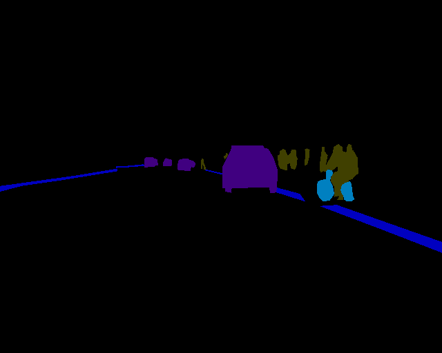

# AdaSeg

The official pytorch implementation of AdaSeg.

The code and dataset will be available upon acceptance of the paper. The following images are some samples of our RT-5K dataset:

          
  
         
  
       
  
        
  
       
  
        

        

Contact: yx.sun@polyu.edu.hk

Website: https://yuxiangsun.github.io/
