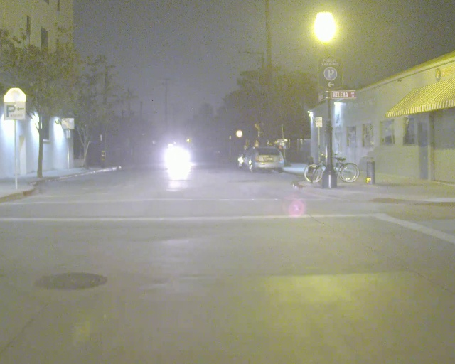

# AdaSeg

The official pytorch implementation of AdaSeg.

The code and dataset will be available upon acceptance of the paper. The following images are some samples of our RT-5K dataset:

   
  
   
  
    
  
    
 
    
  
    
  
    
  
    
  
    

    
  
    
  
     
  
    
  
    
  
    
  
    
  
    

    
  
    

Contact: yx.sun@polyu.edu.hk

Website: https://yuxiangsun.github.io/
